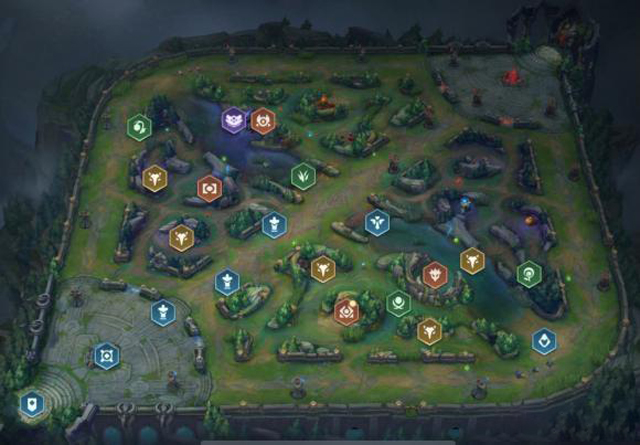

## 一、背景
英雄联盟（League of Legends，LoL）是一个多人在线竞技游戏，由拳头游戏（Riot Games）公司出品。在游戏中，每位玩家控制一位有独特技能的英雄，红蓝两支队伍各有五位玩家进行对战，目标是摧毁对方的基地水晶。水晶有多座防御塔保护，通常需要先摧毁一些防御塔再摧毁水晶。玩家所控制的英雄起初非常弱，需要不断击杀小兵、野怪和对方英雄来获得金币、经验。经验可以提升英雄等级和技能等级，金币可以用来购买装备提升攻击、防御等属性。对战过程中一般没有己方单位在附近的地点是没有视野的，即无法看到对面单位，双方可以通过使用守卫来监视某个地点，洞察对面走向、制定战术。

本数据集来自[Kaggle](https://www.kaggle.com/bobbyscience/league-of-legends-diamond-ranked-games-10-min)，包含了9879场钻一到大师段位的单双排对局，对局双方几乎是同一水平。每条数据是前10分钟的对局情况，每支队伍有19个特征，红蓝双方共38个特征。这些特征包括英雄击杀、死亡，金钱、经验、等级情况等等。一局游戏一般会持续30至40分钟，但是实际前10分钟的局面很大程度上影响了之后胜负的走向。作为最成功的电子竞技游戏之一，对局数据、选手数据的量化与研究具有重要意义，可以启发游戏将来的发展和改进。

## 二、任务
使用决策树模型，根据已有的对局前10分钟特征信息，预测最后获胜方是蓝色方还是红色方。

## 三、评价指标
F1

## 四、模型训练过程及结果
####  详见 train.ipynb

---
---
## 环境参考：

| model | version |
|----------|----------|
| python                    | 3.10.13 |
| joblib                    | 1.3.2 |
| matplotlib                | 3.4.3 |
| matplotlib-inline         | 0.1.6 |
| numpy                     | 1.22.3 |
| pandas                    | 1.5.3 |
| python-dateutil           | 2.8.2 |
| scikit-learn              | 1.3.0 |
| scipy                     | 1.8.1 |
| seaborn                   | 0.12.2 |
| tqdm                      | 4.64.1 |
| ydata-profiling           | 0.0.dev0 |
