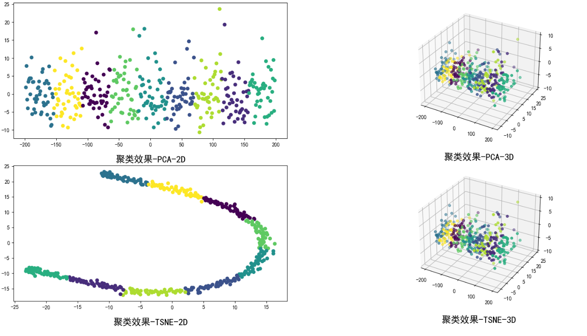

## 一、背景
每年国际上召开的大大小小学术会议不计其数，发表了非常多的论文。在计算机领域的一些大型学术会议上，一次就可以发表涉及各个方向的几百篇论文。按论文的主题、内容进行聚类，有助于人们高效地查找和获得所需要的论文。本案例数据来源于AAAI 2014上发表的约400篇文章，由[UCI](https://archive.ics.uci.edu/dataset/307/aaai+2014+accepted+papers)公开提供，提供包括标题、作者、关键词、摘要在内的信息，希望大家能根据这些信息，合理地构造特征向量来表示这些论文，并设计实现或调用聚类算法对论文进行聚类。最后也可以对聚类结果进行观察，看每一类都是什么样的论文，是否有一些主题。

## 二、任务
* 将文本转化为向量，实现或调用无监督聚类算法，对论文聚类，例如10类（可使用已有工具包例如sklearn）；
* 观察每一类中的论文，调整算法使结果较为合理；
* 对文本向量进行降维，并将聚类结果可视化成散点图。

## 三、评价指标
无监督聚类没有标签，效果较难评价，因此没有硬性指标。人工为主，了解和感受聚类算法，比较简单。

本案后继中参考轮廓系数（Silhouette Coefficient）、CH分数（Calinski Harabasz Score ）和 戴维森堡丁指数(Davies Bouldin Score）结合评价。SC值越大，说明同类样本相距约近，不同样本相距越远，则聚类效果越好；CH index的数值越大越好。DBI的值值越小代表聚类效果越好。因此，使用SC\*CH\*(1/db)来综合评价。

## 四、数据概览

group和topic也不能完全算是标签，因为
1. 有些文章作者投稿时可能会选择某个group/topic但实际和另外group/topic也相关甚至更相关；
2. 一篇文章可能有多个group和topic，作为标签会出现有的文章同属多个类别，这里暂不考虑这样的聚类；
3. group和topic的取值很多，但聚类常常希望指定聚合成出例如5/10/20类；
4. 感兴趣但同学可以思考利用group和topic信息来量化评价无监督聚类结果，不作要求。

## 五、模型训练过程及结果
####  详见 train.ipynb

## 六、聚类结果可视化
在聚类为9个类时，2维、3维和4维的效果差异并不大。可视化中，考虑通过映射至2维和3维，分别使用PCA和TSNE两种方法直观展示聚类效果。

聚类效果从2维上来看， PCA和TSNE方法呈现的不同，TSNE稍直观些；聚类效果从3维上来看，PCA和TSNE方法呈现比较近似。总体上来说，聚类为9类时，效果还是很不错的。
---
---

## 环境参考：

| model | version |
|----------|----------|
| python                    | 3.10.13 |
| matplotlib                | 3.4.3 |
| numpy                     | 1.22.3
| pandas                    | 1.5.3 |
| scikit-learn              | 1.3.0 |
