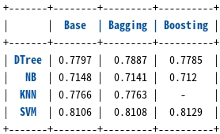

## 一、背景

随着电商平台的兴起，以及疫情的持续影响，线上购物在我们的日常生活中扮演着越来越重要的角色。在进行线上商品挑选时，评论往往是我们十分关注的一个方面。然而目前电商网站的评论质量参差不齐，甚至有水军刷好评或者恶意差评的情况出现，严重影响了顾客的购物体验。因此，对于评论质量的预测成为电商平台越来越关注的话题，如果能自动对评论质量进行评估，就能根据预测结果避免展现低质量的评论。本案例中我们将基于集成学习的方法对 Amazon 现实场景中的评论质量进行预测。

## 二、任务

本案例中需要大家完成两种集成学习算法的实现（Bagging、AdaBoost.M1），其中基分类器要求使用 SVM 和决策树两种：

* Bagging + SVM
* Bagging + 决策树
* AdaBoost.M1 + SVM
* AdaBoost.M1 + 决策树

注意集成学习的核心算法需要**手动进行实现**，基分类器可以调库。

### 基本要求
* 根据数据格式设计特征的表示
* 汇报不同组合下得到的 AUC
* 结合不同集成学习算法的特点分析结果之间的差异
* （使用 sklearn 等第三方库的集成学习算法会酌情扣分）

### 扩展要求
* 尝试其他基分类器（如 k-NN、朴素贝叶斯）
* 分析不同特征的影响
* 分析集成学习算法参数的影响

## 三、评价指标
AUC ：https://scikit-learn.org/stable/modules/model_evaluation.html#roc-metrics

## 四、模型训练过程及结果

 

#### 详见 train.ipynb

---
---
## 环境参考：

| model | version |
|----------|----------|
| python                    | 3.10.13 |
| matplotlib                | 3.4.3 |
| matplotlib-inline         | 0.1.6 |
| nltk                      | 3.8.1 |
| numpy                     | 1.22.3
| pandas                    | 1.5.3 |
| prettytable               | 3.10.0 |
| scikit-learn              | 1.3.0 |
| scipy                     | 1.8.1 |
| snownlp                   | 0.12.3 |
